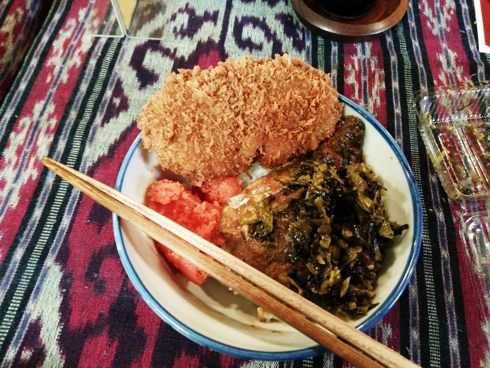
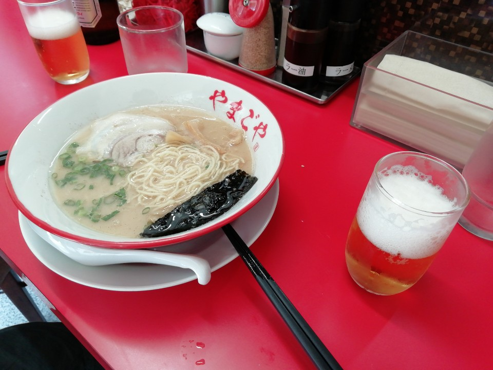
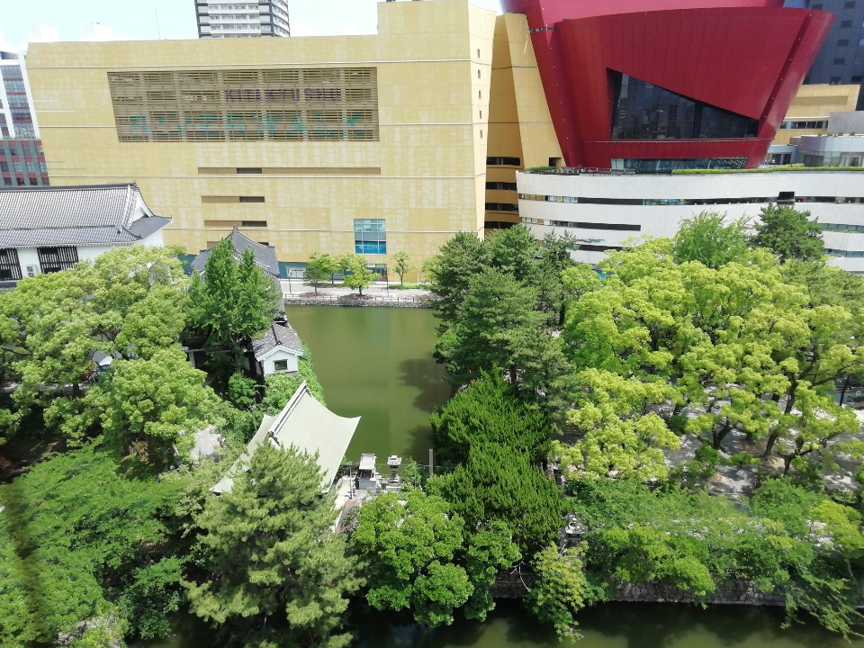
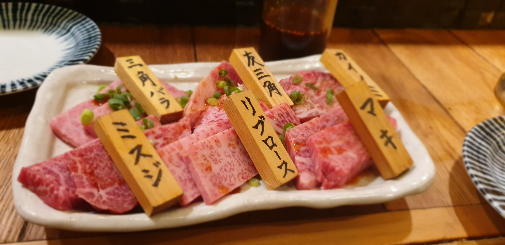
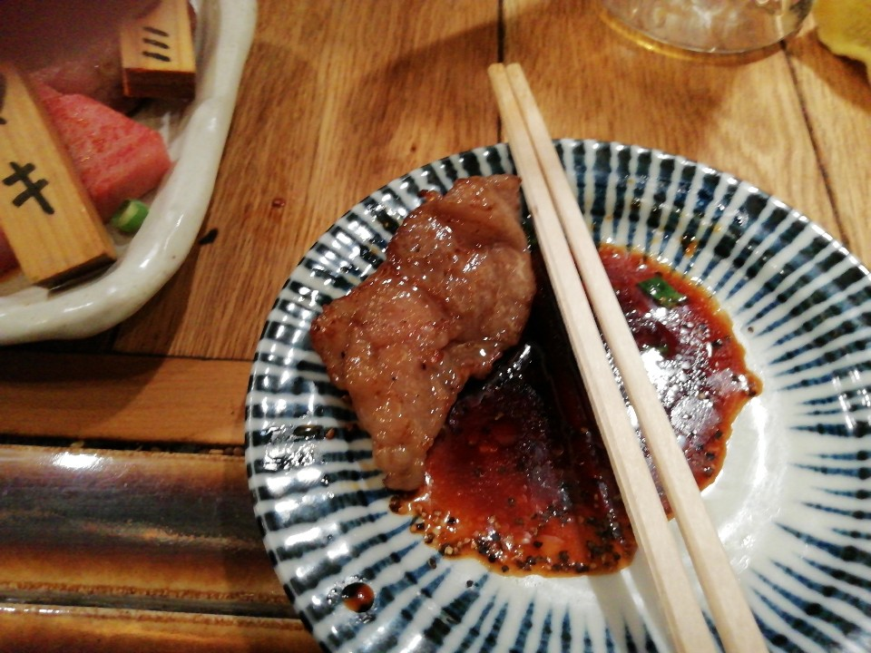
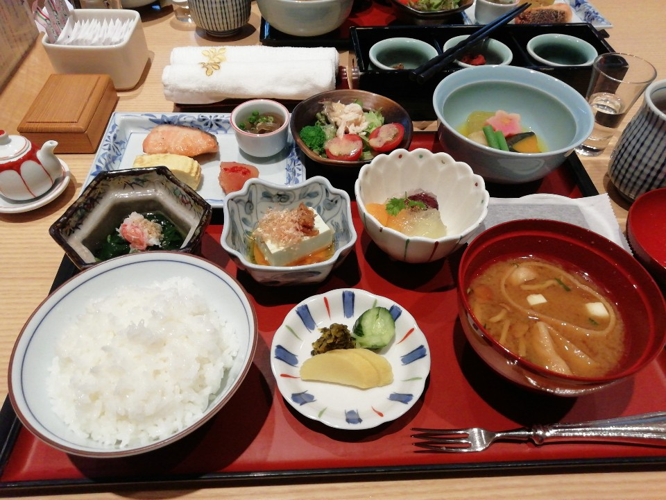

## 키타 큐슈
### 6월 10일 ~ 6월 11일
* 회사가 지원하는 원격 근무지로 일본 후쿠오카를 선택했다.
* 키타 큐슈에 도착하고 처음 구경 했던 건 후쿠오카성이었다. 2006년 여름에 오사카에 놀러갔을 때 오사카성의 보존 상태가 매우 좋아서 좀 놀랐었는데, 이번에 후쿠오카성을 방문하면서 일본에 남아 있는 성들의 상태가 왜 이렇게 좋은지 알게되었다. 현대에 와서 대부분 재건을 했거나 보수를 했기 때문이라나.

* 후쿠오카 성을 나와서 탄가 시장으로 가면서 찍은 사진. 별 것 없다.

* 탄가 시장에 있는 대학당이라는 곳에서 먹은 점심 식사. 시장에 길게 늘어서 있는 반찬집에서 마음에 드는 음식 사고 이 곳에서 밥과 국을 받아 먹는 구조다. 갓 볶음이 아주 맛있어서, 귀국할 때까지 김치 생각이 거의 나지 않았다. 돈까스, 명란 젓, 갓 볶음, 고등어 조림을 사 먹었는데 돈까스가 가장 맛이 없었다. 그냥 한국에서 먹는 딱 그 맛.

* 2차 점심인 라멘. 국물이 걸쭉한 게 입맛에 맞았다. 아사히 병 맥주도 같이 마셨는데, 일본에서 먹은 맥주 중에서 가장 맛났다.

* 후코오카 성 꼭대기에 올라 찍은 전경.

* 저녁에는 소고기를 먹었다. 달달한 양념이 되어 있는 고기 였는데, 매우 연했다. 맛있게 먹음.

## 후쿠오카 (하카타)
### 6월 11일 ~ 6월 14일
* 호텔에서 먹었던 아침 식사. 첫 번째 사진은 일식이고 두 번째 사진은 양식이다. 첫 날만 일식으로 먹고 둘 째날 부턴 양식으로 먹었는데 매일 아침을 이런식으로 먹었다. 밥그릇에 쌀밥, 명란젓과 갓볶음을 올리고 다른 그릇에 양식 음식들을 담아서 두 그릇씩 흡입했다. 갓볶음이 아주 훌륭했음.

