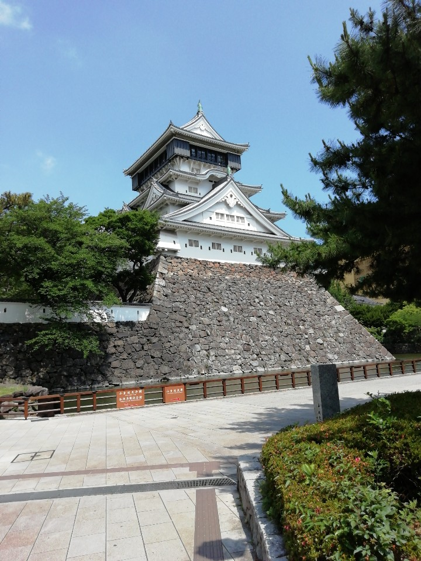
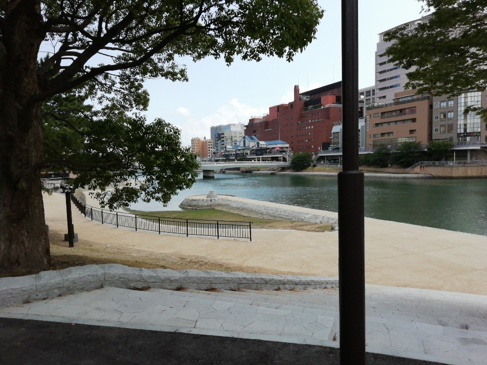
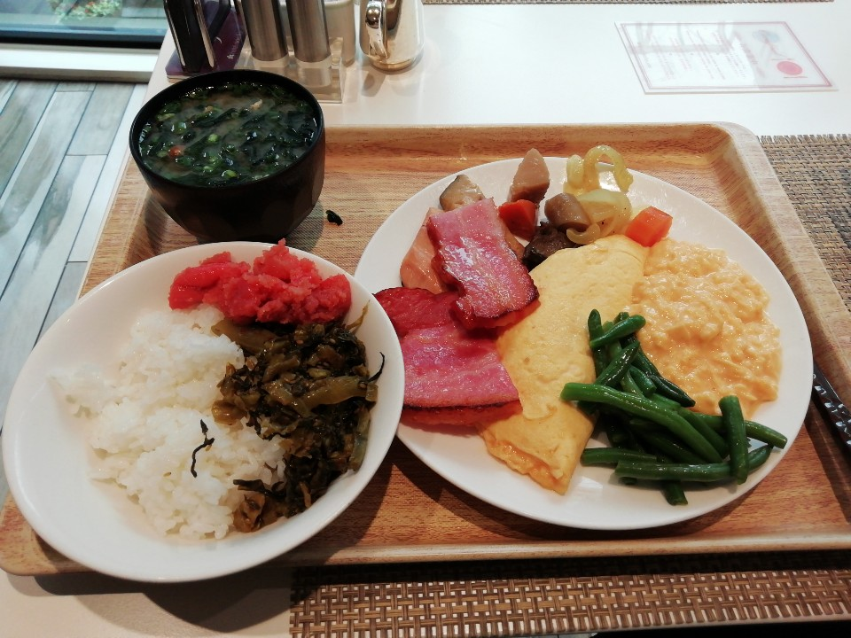

## 키타 큐슈
### 6월 10일 ~ 6월 11일
* 회사가 지원하는 원격 근무지로 일본 후쿠오카를 선택했다.
* 키타 큐슈에 도착하고 처음 구경 했던 건 후쿠오카성이었다. 2006년 여름에 오사카에 놀러갔을 때 오사카성의 보존 상태가 매우 좋아서 좀 놀랐었는데, 이번에 후쿠오카성을 방문하면서 일본에 남아 있는 성들의 상태가 왜 이렇게 좋은지 알게되었다. 현대에 와서 대부분 재건을 했거나 보수를 했기 때문이라나.

* 후코오카 성을 나와서 탄가시장으로 가면서 찍은 사진. 별 것 없다.

## 후쿠오카 (하카타)
### 6월 11일 ~ 6월 14일
* 아래 사진은 호텔에서 먹었던 아침 식사. 매일 아침을 이런식으로 먹었다. 밥그릇에 쌀밥에 명란젓과 갓볶음을 올리고, 다른 그릇에 양식 음식들을 담아서 두 그릇씩 흡입했다. 갓볶음이 아주 훌륭했음.
