## 키타 큐슈
### 6월 10일 ~ 6월 11일
* 회사가 지원하는 원격 근무지로 일본 후쿠오카를 선택했다.
* 키타 큐슈에 도착하고 처음 구경 했던 건 후쿠오카성이었다. 2006년 여름에 오사카에 놀러갔을 때 오사카성의 보존 상태가 매우 좋아서 좀 놀랐었는데, 이번에 후쿠오카성을 방문하면서 일본에 남아 있는 성들의 상태가 왜 이렇게 좋은지 알게되었다. 현대에 와서 대부분 재건을 했거나 보수를 했기 때문이라나.

* 후쿠오카 성을 나와서 탄가 시장으로 가면서 찍은 사진. 별 것 없다.

* 탄가 시장에 있는 대학당이라는 곳에서 먹은 점심 식사. 시장에 길게 늘어서 있는 반찬집에서 마음에 드는 음식 사고 이 곳에서 밥과 국을 받아 먹는 구조다. 갓 볶음이 아주 맛있어서, 귀국할 때까지 김치 생각이 거의 나지 않았다. 돈까스, 명란 젓, 갓 볶음, 고등어 조림을 사 먹었는데 돈까스가 가장 맛이 없었다. 그냥 한국에서 먹는 딱 그 맛.

* 2차 점심인 라멘. 국물이 걸쭉한 게 입맛에 맞았다. 아사히 병 맥주도 같이 마셨는데, 일본에서 먹은 맥주 중에서 가장 맛났다.

* 후코오카 성 꼭대기에 올라 찍은 전경.

* 저녁에는 소고기를 먹었다. 달달한 양념이 되어 있는 고기 였는데, 매우 연했다. 맛있게 먹음.

* 숙소 들어와서 TV 좀 보다가 심심해서 밖에 나갔다가 들린 가게다. 생선 살 완자, 두부 조림, 스지 조림을 시켰는데 생선 살 완자는 좀 비렸고 나머진 다 먹을만 했다. 특히 두부가 부들부들 맛났다.
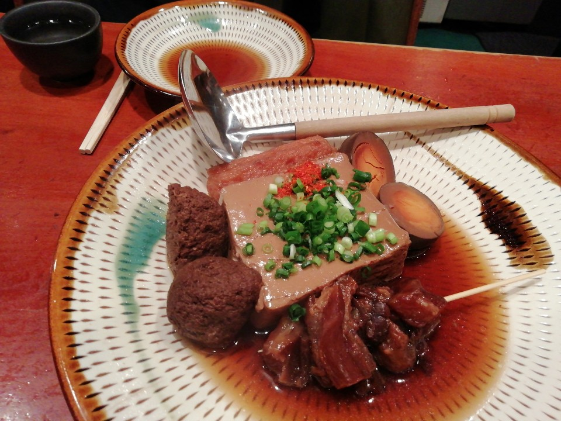
* 6월 11일 아침에 방문했던 해안가에 있는 동네다. 무슨 해변인지는 까먹었고, 엄청난 성게 빵의 향과 맛만 기억에 남아 있다. 정말 미친듯이 맛 없고 비렸다. 이 게 거진 만 원돈이라니...
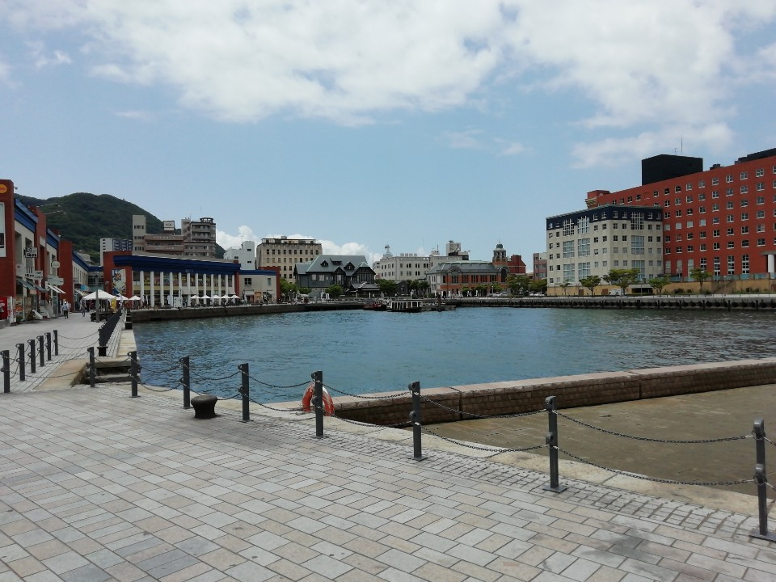
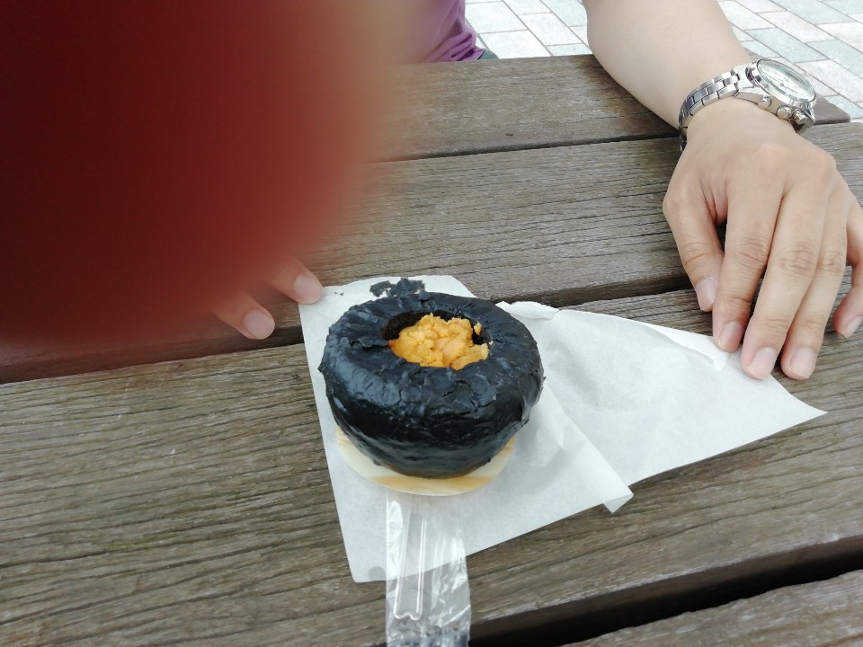
* 점심으로 먹은 야키 카레. 짭다. 맛 없다.

## 후쿠오카 (하카타)
### 6월 11일 ~ 14일
* 호텔에서 먹었던 아침 식사. 첫 번째 사진은 일식이고 두 번째 사진은 양식이다. 첫 날만 일식으로 먹고 둘 째날 부턴 양식으로 먹었는데 매일 아침을 이런식으로 먹었다. 밥그릇에 쌀밥, 명란젓과 갓볶음을 올리고 다른 그릇에 양식 음식들을 담아서 두 그릇씩 흡입했다. 갓볶음이 아주 훌륭했음.

* 이 집은 스트리트 푸드 파이터에서 백종원 아재가 방문했던 가게다. 첨에 문을 열었는지 안 열었는지 알 수가 없어서 좀 헤맸다. 가장 먼저 시킨 건 고등어회에 깨를 간 소스를 넣은 회였다. 무지하게 비렸다. 다 먹긴 했는데 그닥 맛있는지는 모를 음식이다. 그 다음에 주문한 음식이 바로 모츠 나베. 맑은 국물 곱창 전골인데 이게 의외로 먹을만 했다. 비리지도 않고 간도 좋았고 곱창과 대창의 양도 푸짐했다. 매우 만족스러웠던 음식이었다. 모츠 나베가 후쿠오카 명물이라고 들었는데 그럴만 한듯 하다. 나베에 넣어 먹을 면도 준다. 다 먹으면 엄청 배부름 주의.
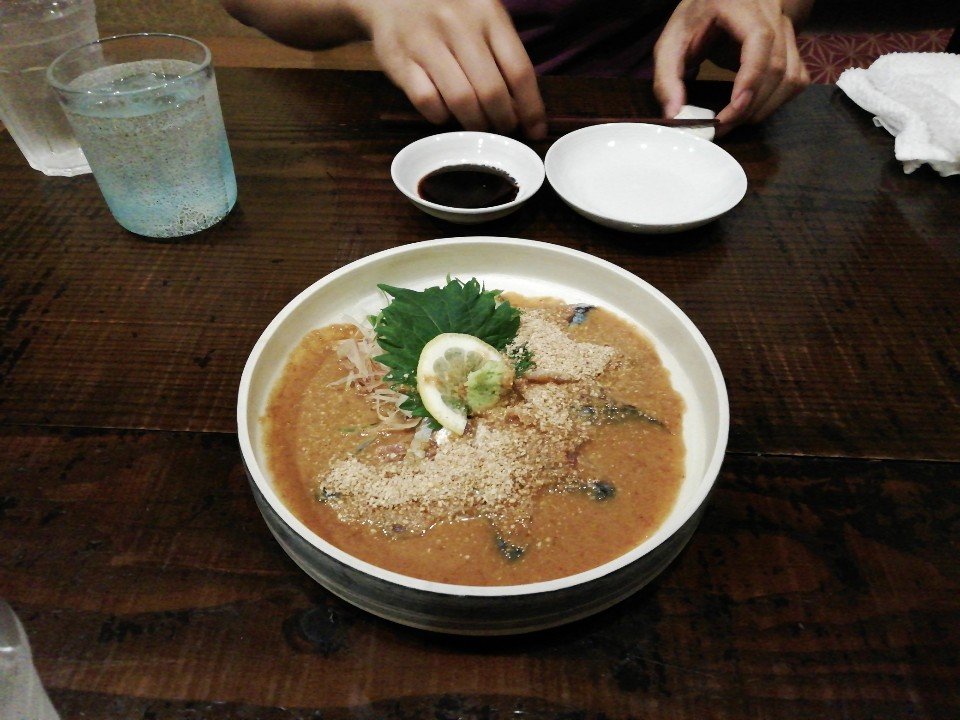
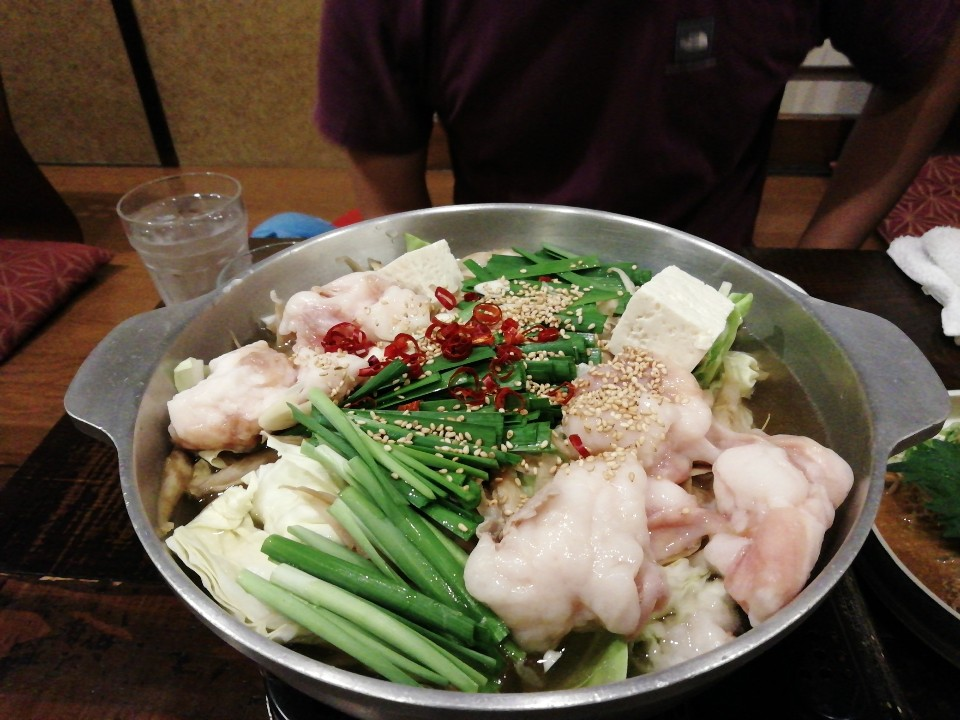
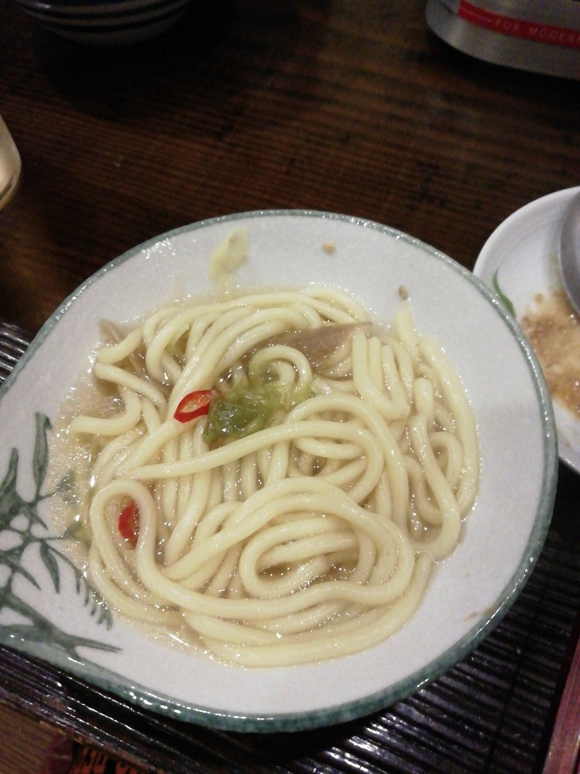
* 저녁에 밖에 나와서 돌아다니다가 우연히 들어간 만두집이다. 일본에서는 만두를 교자라고 하던데, 이 집은 야끼교자와 닭 날개 튀김을 팔았다. 가게 밖에 적혀 있는 만두 가격이 무척 싸서 들어갔는데, 싼 값을 하더라. 맛도 그닥이고 양도 적고, 닭 날개는 튀긴지 삼일은 된 듯한 맛이었다.
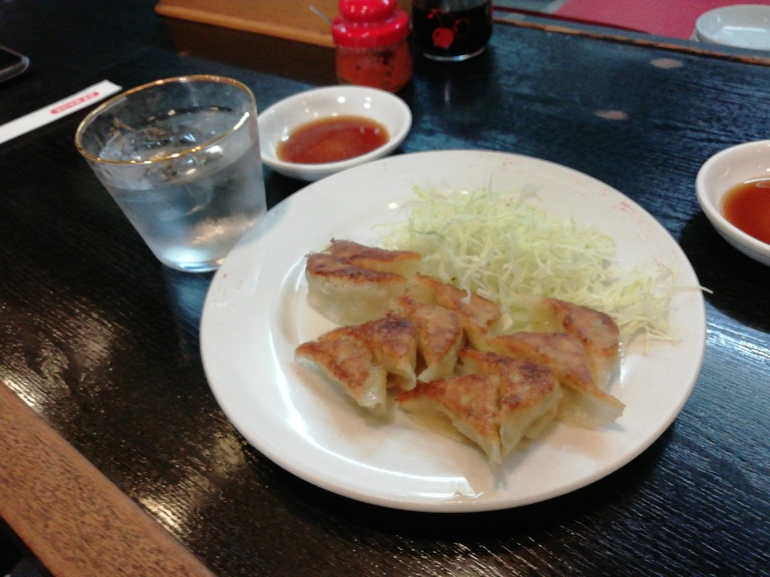
* 늦은 밤 숙소 근체 초밥집에서 먹은 참치 초밥. 먹을만 했다.
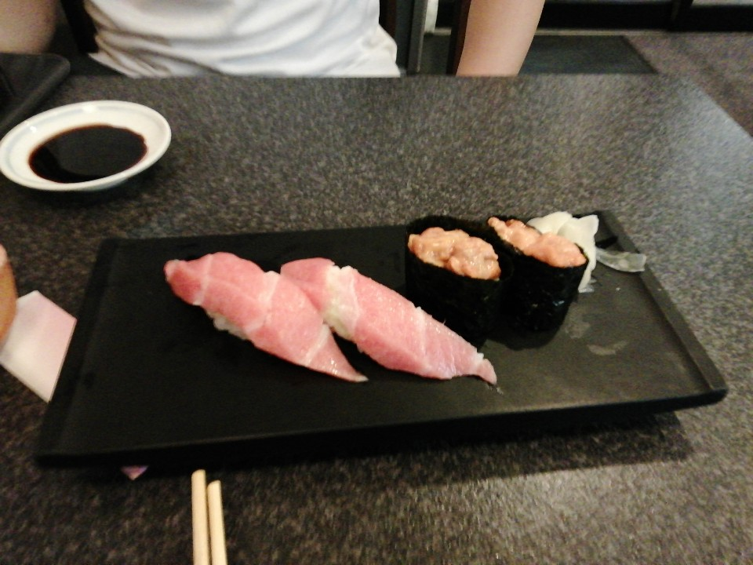
* 아사히 맥주 공장도 방문 했다. 사전 예약을 거쳐 견학을 하는 방식이었는데, 내가 갔을 때 참관객은 거의 한국인이었다. 20분 정도 공장 직원의 설명을 듣고 맥주 시음을 했다. 시원하고 맛있긴 했는데, 듣던 만큼 엄청난 수준은 아니었다. 첫날에 라멘 집에서 먹은 아사히 병맥주가 더 맛있게 느껴졌다.
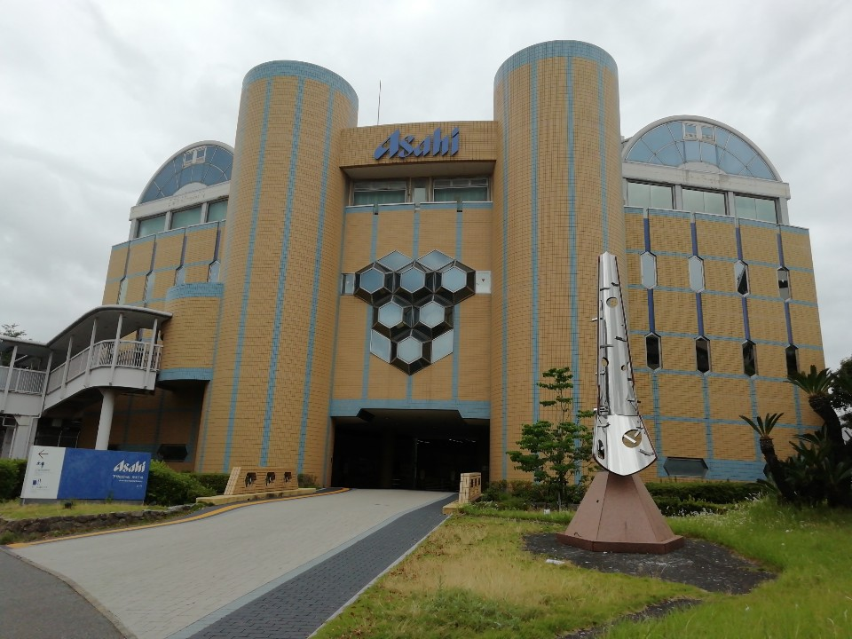
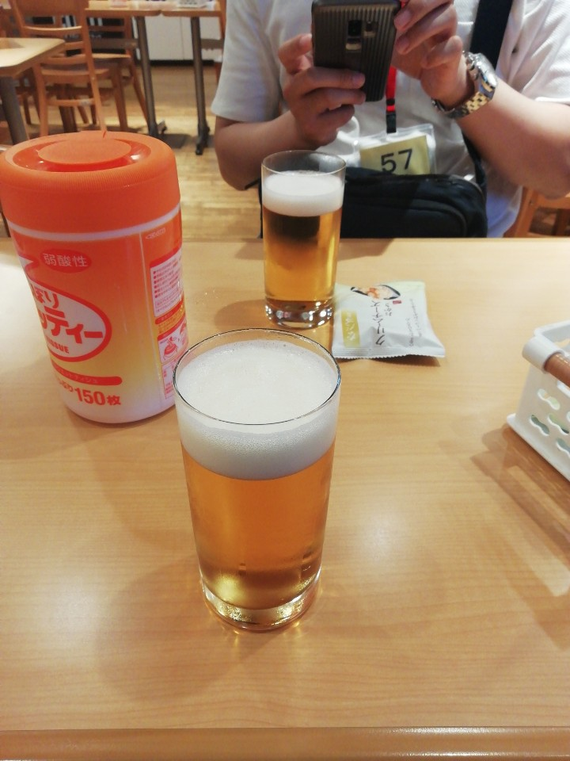
* 이치란 라멘이 일본에서 제일 유명한(?) 라멘 체인이라고 들었다. 후코오카는 이치란 라멘의 본점이 있는 곳이니, 안 가볼 수 없었다. 그래서 방문했다. 쪽파하고 계란 같은 토핑을 추가 주문하니 돈이 꽤 나왔다. 1200엔 이상 나온듯. 괜찮은 맛이었다. 비주얼은 내가 먹은 라멘 중 갑이었다.
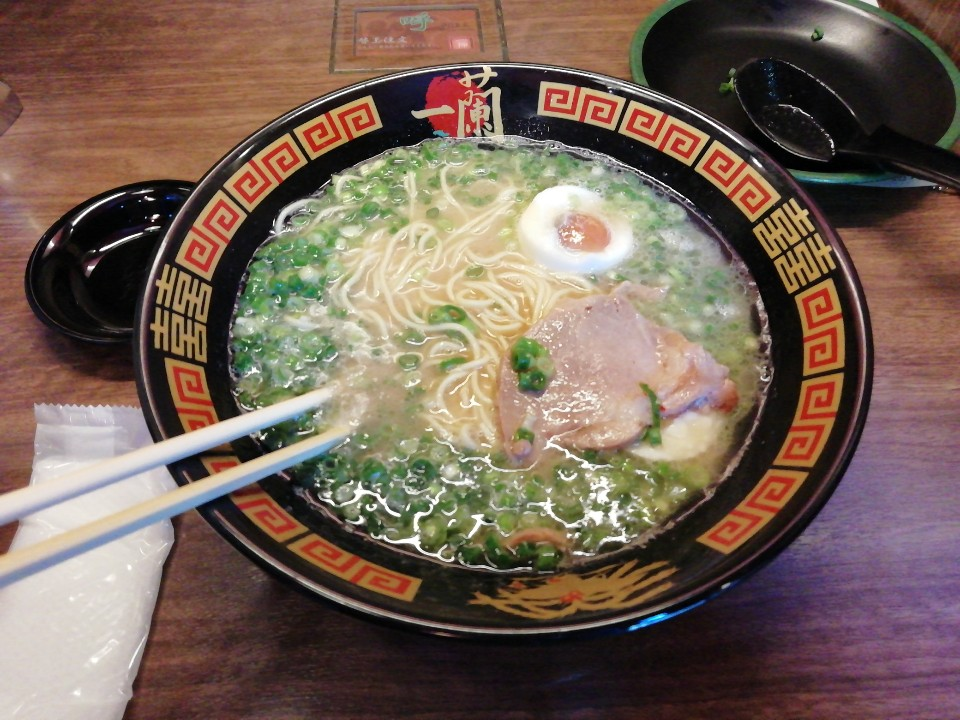
* 라멘 먹고 근처 백화점 지하 식당가에서 튀김을 먹었다. 바삭하니 잘 튀겨서 맛있게 먹었다.
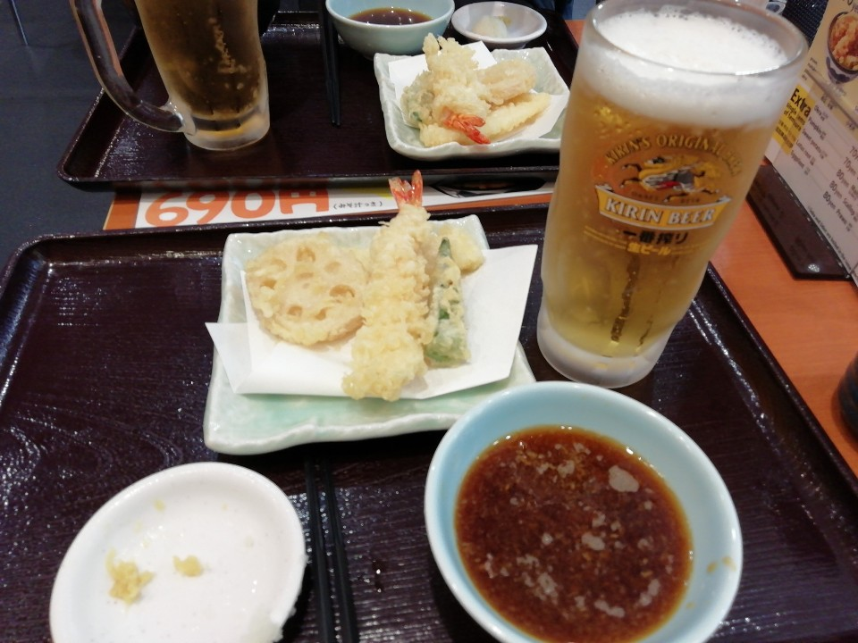
* 후쿠오카 여행 중에 두 번 방문한 유일한 집. 철판 스테이크 집이다. 소고기 스테이크와 불고기(같은 맛이 나는 고기), 숙주 볶음이 나온다. 소고기는 상당히 맛있었는데, 불곡기가 엄청 짰다. 밥 없으면 못 먹을 정도였다. 그래도 매우 만족스러운 가게였다. 가격도 15000원 대였던 것 같은데, 이 정도 음식에 15000원 정도면 주 1회는 방문할 수 있을듯.
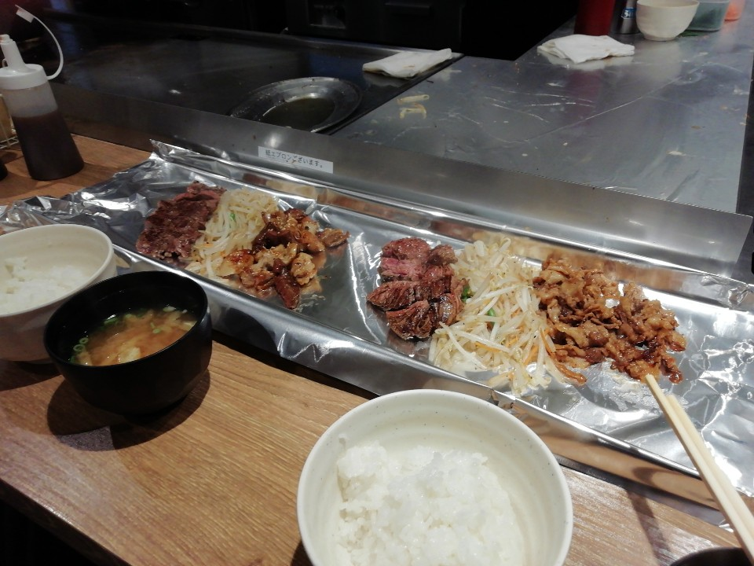
* 스트리트 푸드 파이터에서 백종원 아재가 방문한 야타이를 가봤다. 너무 이른 시간이라 영업을 하지 않아서 근처 음식점으로 향했다. 치킨 가라아게하고 만두를 시켜서 먹었는데 그닥 맛이 있지는 않았다.
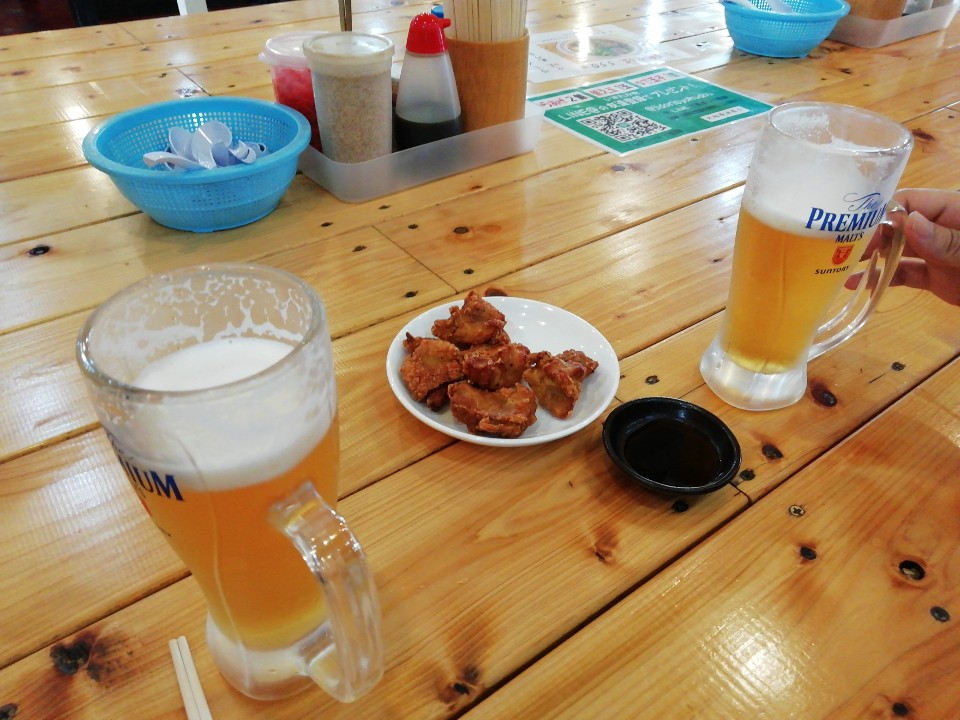